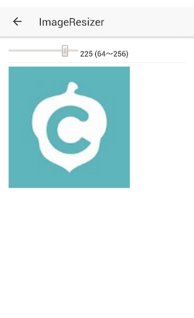
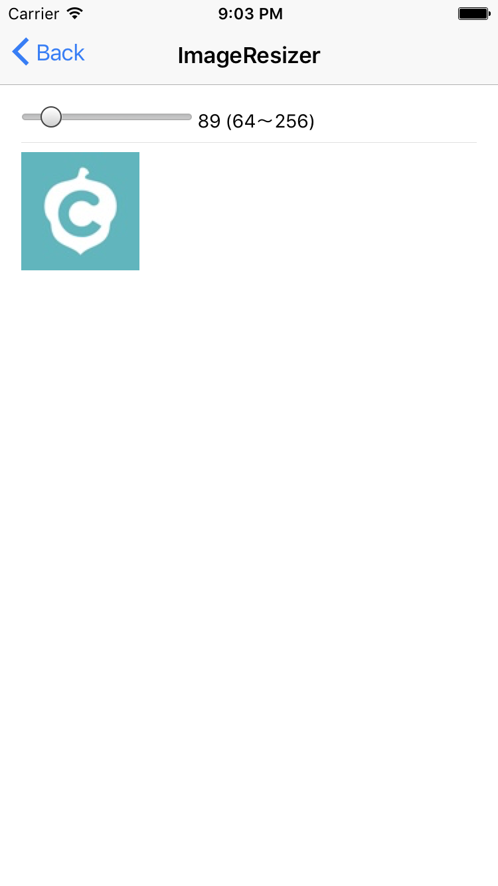

# cordova-plugin-image-resizer
画像の情報取得、リサイズ、保存
https://github.com/protonet/cordova-plugin-image-resizer





## 使いかた

ImageResizer.resize() に options を渡し、 then で受け取る
ファイルの指定は URI になる。

* Android は `folderName` が必須
* iOS は `fileName` が必須

```javascript
ImageResizer
  .resize({
    uri: srcFilePath,
    folderName: 'PluginSamples', // required for Android
    fileName: 'pluginsamples_thumbnail.png', //required for ios
    quality: 90,
    width: size,
    height: size
  }).then(
    (filePath: string) => { this.destinationImageSrc = filePath },
    (err) => { console.error(err) }
 )
```

リサイズした結果はアプリローカルに保存され、そこへのローカルパスが返ってくる

結果:
* ちっちゃいの

* おっきいの  
