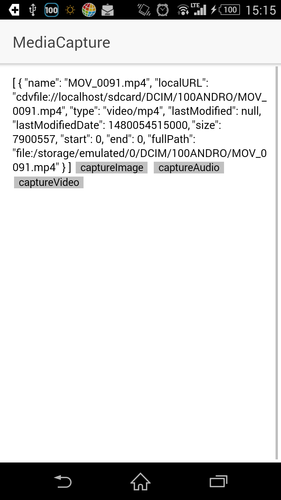

# cordova-plugin-media-capture
動画撮影、写真撮影、音声録音の機能を呼び出す
https://www.npmjs.com/package/cordova-plugin-media-capture

## 実装方法

```html
<button (click)="captureImage()">captureImage</button>
```

```javacsript
captureImage(){
  MediaCapture.captureImage().then( res => {
    this.result = res
  })
}
```

captureImage()にoptionを渡せるが、一回のオペレーションで撮れる画像の数に制限をかけるとかそういう程度

## 動作イメージ




## 解説

動作としては単純で、各OSがデフォルトで持っているカメラ撮影、音声録音、ビデオ録画の機能を呼び出し、それぞれの処理結果を受け取っているだけ、になる

取得したファイルはAndroid/iOS双方とも、標準のメディアライブラリに登録される

AndroidはSDカードに保存する必要があるようで、SD挿していない扱いのエミュレータでは動作しなかった
