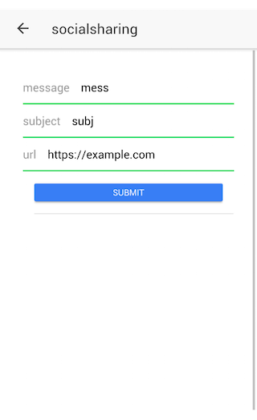

# cordova-plugin-socialsharing
いわゆる[共有]メニュー
https://www.npmjs.com/package/cordova-plugin-socialsharing

https://github.com/medi-y-sato/PluginSample/blob/master/src/pages/socialsharing/socialsharing.ts

要は他のアプリにIntentを渡す仕組み。


## 実装方法

```javascript
import { SocialSharing } from 'ionic-native'
```

```javascript
SocialSharing.shareWithOptions(
  {
    message: <<メッセージ内容>>,
    subject: <<メールソフトへ共有したときなどに使用されるタイトル>>,
    files: ['<<共有するファイルへのパス>>', ''],
    url: <<URLを共有する再に使用>>,
    chooserTitle: '共有する:'
  },
).then(
  result => console.log(result.completed + "/" + result.app),
  msg => console.log("Sharing failed with message: " + msg)
)
```

## 動作イメージ




## 解説

用途に合わせて送るデータを選択する。Twitterなら `subject` 要らないね、など
送り先のアプリが対応していれば、例えばURLならFacebookはページ共有としてハンドリングしてくれるし、TwitterはURL短縮対象に選んでくれる

SocialSharing.shareVia****() というメソッドがいくつも用意されており、TwitterやFacebook、EMailなどをダイレクトに指定したりも出来る。
