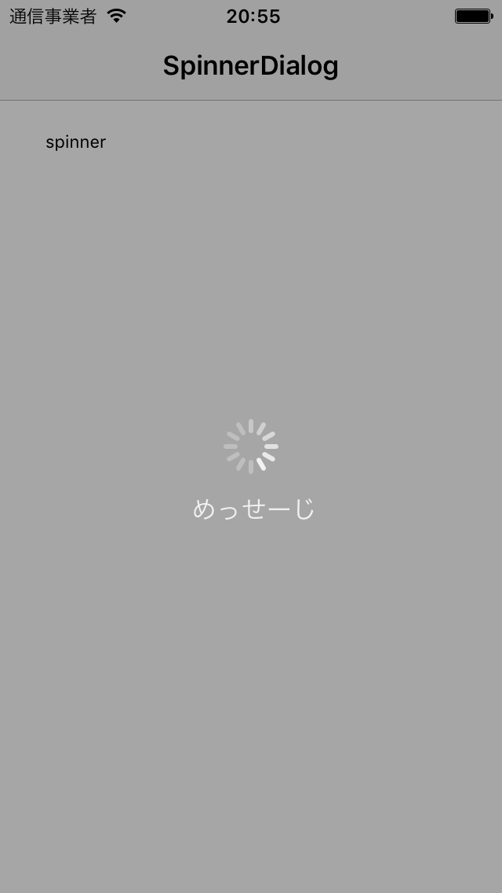
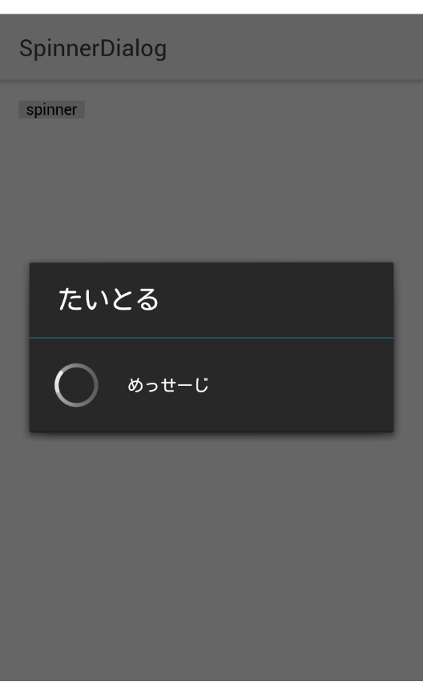

# cordova-plugin-spinner-dialog
スピナー表示
https://github.com/Paldom/SpinnerDialog


## 使いかた

```javascipt
if ( ! this.spinnerActive ){
  SpinnerDialog.show('たいとる', ' めっせーじ')
  this.spinnerActive = true
}else{
  SpinnerDialog.hide()
  this.spinnerActive = false
}
```





SpinnerDialog.show() に直接引数を渡す
cancelCallbackにtrueを指定しない場合、任意の場所のタップでスピナーを終了させられる

* `title` : タイトル (Androidのみ)
* `message` : 表示されるメッセージ
* `cancelCallback` : true だとスピナーのキャンセルができなくなる。コールバックを書いておくと、キャンセルされた時に呼ばれる
* `iOSOptions` : iOS用のオプションらしい

iOSオプションの例 :
```
{
  'overlayOpacity': 0.35,
  'textColorRed': 1,
  'textColorGreen': 1,
  'textColorBlue': 1
}
```
